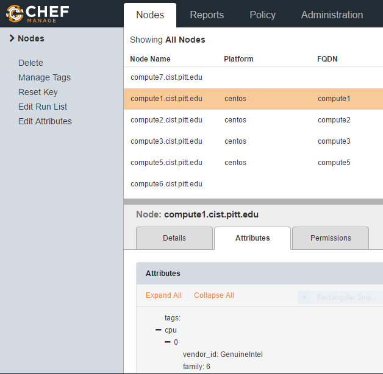

### Chef searched

Chef search allows queries to be made for any type of data that is indexed by the chef server. Search queries the chef server for stored information.  

Searches can include:  
- data bags  
- environments  
- roles  
- node

To search all nodes that match a specific attribute, use the "knife search node" command:
Searching with knife:  
`$ knife search node "key:pattern" -a (attribute)`  

```
[thn16@chef .chef]$ knife search node platform:centos
4 items found

Node Name:   compute1.cist.pitt.edu
Environment: _default
FQDN:        compute1
IP:          136.142.139.131
Run List:
Roles:
Recipes:
Platform:    centos 7.3.1611
Tags:
```

To view a list of all available attributes, log into the Chef server web interface, click 'Nodes' > 'Attributes'  



You can also search for attributes of a specific node:  
`$ knife node show <node name> -a kernel`  

Searching nested attributes; when searching nested attributes, use an underscore ("\_") between main attribute and its nested property. When you want to show the value of the nested attribute, separate them with a period ("."):  
`$ knife search node kernel_release:3.* -a kernel.release`

```
$ knife search node kernel_release:3.* -a kernel.release
4 items found

compute1.cist.pitt.edu:
  kernel.release: 3.10.0-514.10.2.el7.x86_64

compute2.cist.pitt.edu:
  kernel.release: 3.10.0-514.10.2.el7.x86_64

compute3.cist.pitt.edu:
  kernel.release: 3.10.0-514.10.2.el7.x86_64

compute5.cist.pitt.edu:
  kernel.release: 3.10.0-514.10.2.el7.x86_64
```

To search for attributes of a specific node, use "knife node show":  
`$ knife node show compute1.cist.pitt.edu -a kernel.release`  

```
$ knife node show compute1.cist.pitt.edu -a kernel.release
compute1.cist.pitt.edu:
  kernel.release: 3.10.0-514.10.2.el7.x86_64
```

Use AND to combine your searches:  
`$ knife search node "os:linux AND platform_family:centos" -a platform`  

```
knife search node "os:linux AND platform:centos" -a platform
4 items found

compute1.cist.pitt.edu:
 platform: centos

compute2.cist.pitt.edu:
 platform: centos

compute3.cist.pitt.edu:
 platform: centos

compute5.cist.pitt.edu:
 platform: centos
```
